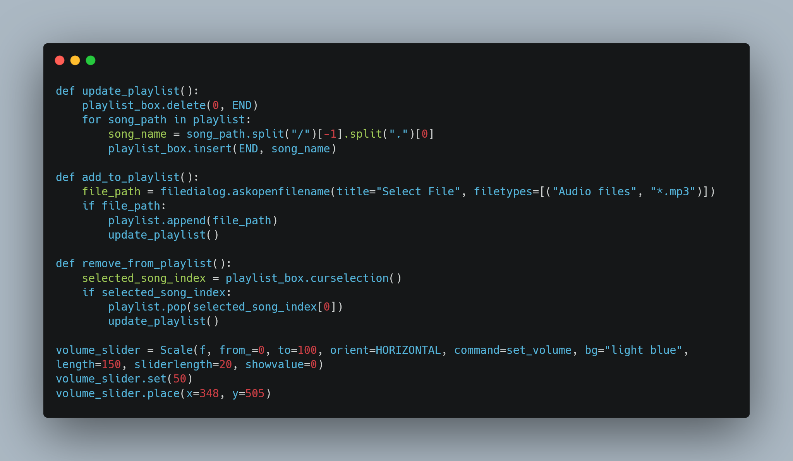

# Music Player with tkinter


## Getting Started

A very simple music player where you can upload local files.

## Installation Instructions

1. #### Clone the repository
   
   ```bash
   git clone https://github.com/Smokez01/Economy-Discord-Bot-Python
   ```
   
2. #### Install Dependencies:

   ```bash
   pip install -r requirements.txt
   ```

## Usage

If you would like to use this bot, personally or commercially, please give me ([Smokez01](https://github.com/Smokez01)) credit.

## Code Showcase



## Built With

[tkinter](https://docs.python.org/3/library/tkinter.html) - The library used

[Python](https://www.python.org/) - The Runtime

## Contributing
Any pull request's are welcome!

## Issues

If you have any issue, please don't hesitate to make a [issue](https://github.com/Smokez01/Music-Player/issues), I will gladly take a look at it and try to fix it!

## Authors

Smokez01 - Initial work & all the project - [Smokez01](https://github.com/Smokez01)

## License

This project is licensed under the MIT License - see the [LICENSE](https://github.com/Smokez01/Music-Player/blob/main/LICENSE) file for details
